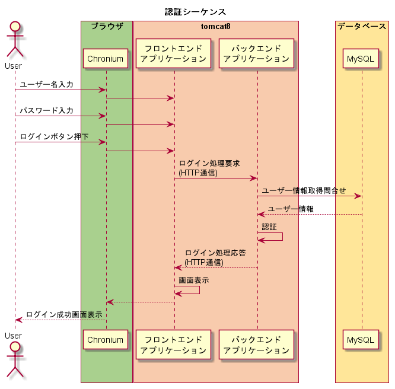

# ソフトウェア構成

## 概要

* システムはユーザーに対して、ウェブアプリケーションを提供することで、コーヒーチケット管理を実現する。

## ソフトウェア構成図

### ソフトウェア構成概要

* OS
	* Raspbian
		* ラズベリーパイ財団が公式に出しているOS
		* Debian BaseのOS
* ブラウザ
	* Chromium
		* オープンソースのウェブブラウザ
		* ユーザーが画面操作するときに使用する
* ウェブコンテナ
	* tomcat
		* Java ServletやJavaServer Pages (JSP) を実行するためのウェブコンテナ（サーブレットコンテナ、サーブレットエンジン)
		* フロントエンドアプリケーション、バックエンドアプリケーションの実行に必要。

* フロントエンドアプリケーション
	* HTML
		* 専らHTTPが利用されるWWWのハイパーテキストの記述に使われているマークアップ言語
		* ユーザーに表示する画面の表示
	* JavaScript
		* バックエンドの呼び出しや、画面の制御を行う
* バックエンドアプリケーション
	* WAR
		* Java Platform, Enterprise Edition (Java EE) アプリケーションのパッケージ形式
		* ビジネスロッジクを処理する
* データベース
	* MySQL
		* オープンソースで公開されている関係データベース管理システム (RDBMS) の一つ
		* コーヒーチケットのデータやユーザー情報を格納する

### シーケンス例

### バージョン情報

| 種類 | 名称 | バージョン |
|--------|--------|--------|
|OS|Raspbian(Debian)|8.0|
||カーネル|Linux raspberrypi 4.9.24-v7+ #993|
|ブラウザ|Chromium|56.0.2924.84|
|ウェブコンテナ|tomcat|8.0.14-1+deb8u8|
|バックエンド|Java|1.8.0_65(Oracle)|
|データベース|MySQL|5.5.54-0+deb8u1|
