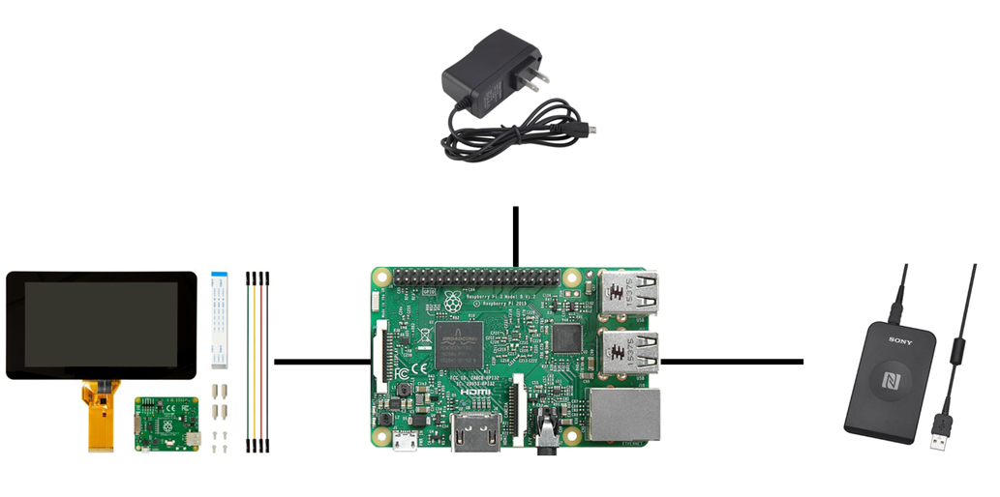

# ハードウェア構成

## 概要
* コンピュータ
	* Raspberry Pi 2 Model B
		* ARMプロセッサを搭載したシングルボードコンピュータ
* タッチパネル
	* Raspberry Pi Touchscreen
		* Raspberry Pi用のタッチスクリーン
		* 画面の大きさは7インチ、解像度は800 x 480ピクセル
* カードリーダー
	* RC-S380 P
		* NFC経由でカード番号を取得する
		* カード番号とチケットIDを紐づけるために使用される
* 電源
	* マイクロUSB

## ハードウェア仕様

### Raspberry Pi 2 Model B
|  | スペック |
|--------|--------|
|CPU|クアッドコア 900 MHz|
|GPU|400 MHz (3D 250 MHz)|
|メモリ (GPUと共用）|1 GB|
|USB 2.0 ポート|4つ|
|ストレージ|microSDカード(32GB)|
|ネットワーク|LAN9514 10/100 Mbps イーサネット|
|電源|1.4A (7 W) 最大 2.5 A (12.5 W)|
|電源ソース|microUSBまたはGPIO|

* 参照URL(https://ja.wikipedia.org/wiki/Raspberry_Pi)

### Raspberry Pi Touchscreen

||スペック|
|--------|--------|
|大きさ|7インチ 194mm x 110mm x 20mm|
|解像度|800 x 480ピクセル|
|色|24ビットカラー|
|インターフェース|DSIポート|
|電源|USBまたはRaspberry PiのGPIO|
|備考|10点マルチタッチ可能|

* 参照URL(https://www.raspberrypi.org/documentation/hardware/display/)