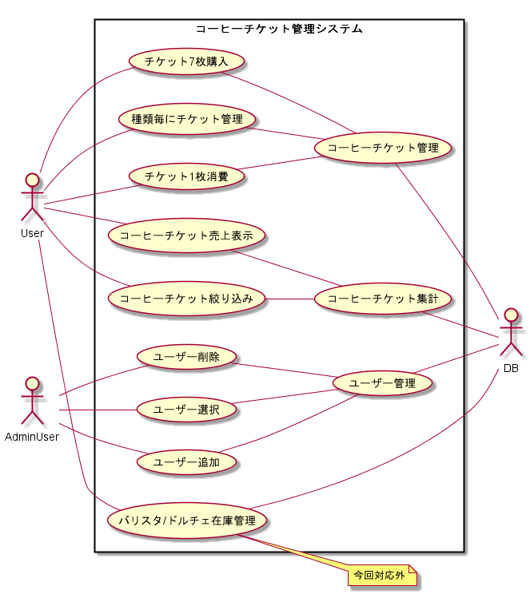
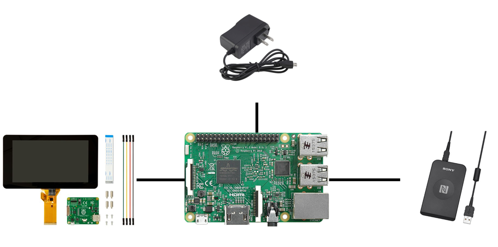
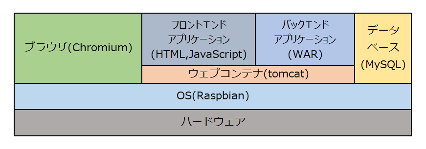
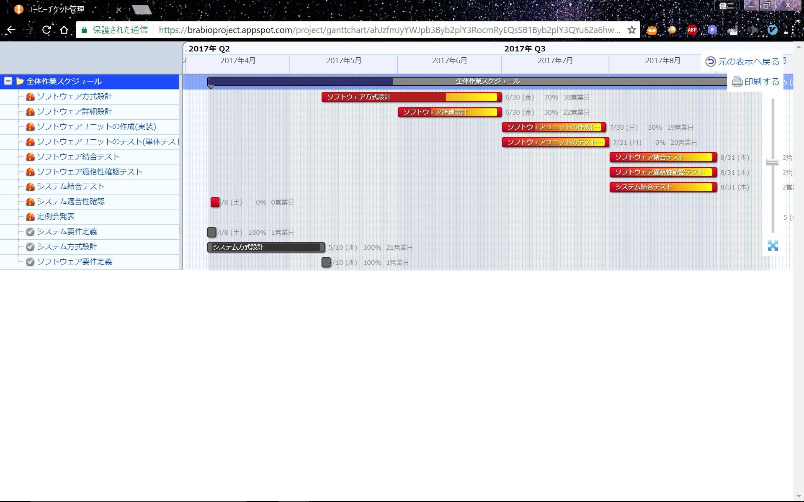

<!-- *template: ns-custom -->

チームカフェオレ 発表資料

# 永井　山田(翔史)　尾添

---

# 前半
1. 課題に関して
2. 開発プロセス
3. システム要件定義
	* 要求定義
	* ユースケース図
4. システム方式設計
	* ハードウェア構成
	* ソフトウェア構成
5. ソフトウェア要件定義
    * コーヒーチケット管理システム仕様書
6. ソフトウェア方式設計
    * シーケンス図
    * Swagger
----

# 後半

1. 単体試験
2. 結合評価
3. スケジュール計画
4. スケジュール実績
5. スケジュール遅延要因

---
<!-- *template: ns-custom -->
# 課題に関して1

## 課題で何を作成するか以下のものが挙げられた

* 脳トレ
* ゲーム
* 動画編集アプリ
* コーヒーチケット管理

---
<!-- *template: ns-custom -->
# 課題に関して2

* コーヒーチケット管理に決定
* 決定理由は以下のため
	* 規模が大きくない
	* 内容が身近で分かりやすい

---
<!-- *template: ns-custom -->
# 開発プロセス

## 開発プロセスはVモデルに準拠して、行った。

---

---

<!-- *template: ns-custom -->
# システム要件定義

## 要求定義

* コーヒーチケット管理の煩雑さを減らしたい
* ユーザー毎にチケット管理をしたい
* コーヒーチケットの集計がしたい

## 要件定義
* 量が多いので、略

## ユースケース図

---

---

<!-- *template: ns-custom -->
# システム方式設計1
## ハードウェア構成
* コンピュータ
	* Raspberry Pi 2 Model B
		* ARMプロセッサを搭載したシングルボードコンピュータ
* タッチパネル
	* Raspberry Pi Touchscreen
		* Raspberry Pi用のタッチスクリーン
		* 画面の大きさは7インチ、解像度は800 x 480ピクセル
* カードリーダー
	* RC-S380 P
		* NFC経由でカード番号を取得する
* 電源
	* マイクロUSB

---

---

<!-- *template: ns-custom -->
# システム方式設計2
## ソフトウェア構成

### 概要

* システムはユーザーに対して、ウェブアプリケーションを提供することで、コーヒーチケット管理を実現する。

### ソフトウェア構成図

---

<!-- *template: ns-custom -->
# ソフトウェア要件定義
## コーヒーチケット管理システム仕様書

### 構成

1. 01_ユーザー認証
2. 02_コーヒーチケット管理システム(共通画面)
3. 03_コーヒーチケット集計
4. 04_コーヒーチケット管理
5. 05_ユーザー管理
---

<!-- *template: ns-custom -->
# ソフトウェア方式設計1
## シーケンス図
* ユーザーとシステムのやり取りを実現するために、どのようなAPIが必要になってくるかを明確化し実装し易くするために実施した。
* 使用したツール等
PlantUML

---

<!-- *template: ns-custom -->
# ソフトウェア方式設計2
## Swagger
* WebAPPで使用されるI/F仕様書
* Javaのアノテーションを使ってソースコードに記述することが可能
* SwaggerからAPIを呼び出すことが可能
---

<!-- *template: ns-custom -->
# 単体試験

* jUnitを用いて、テストコード作成する計画

---

<!-- *template: ns-custom -->
# 結合評価

* 試験書作成し、試験する計画

---

<!-- *template: ns-custom -->
# スケジュール計画

---
# スケジュール実績
* システム要件定義
    * オンスケ
* システム方式設計
    * オンスケ
* ソフトウェア要件定義
    * ~6M
* ソフトウェア方式設計
    * シーケンス6M~8E
    * REST API仕様書 9B~未完了
* ソフトウェアユニットの作成(実装)
    * 12~1E予定
* 評価
    * 3E予定
---

# スケジュール遅延要因
* 各メンバーの作業工数が取れなかった
* GIT/PlantUML/Swaggerなどメンバーがよくわかっていない技術を使っていたたため、ソフトウェア方式設計に工数がかかりすぎた
* 上記フォローが不十分だった

