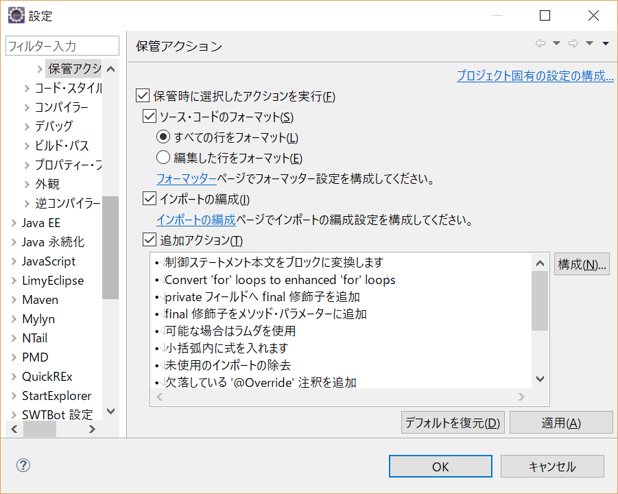
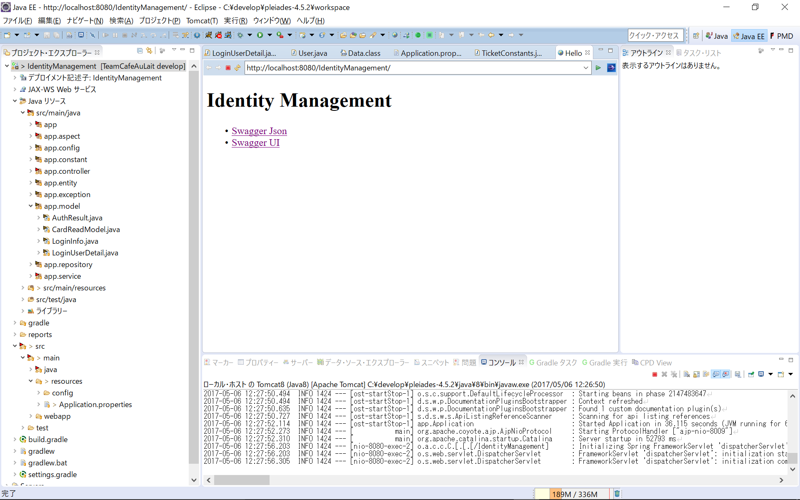

# eclipse設定_実行

[TOC]

## 前提条件
* mysqlのインストール、初期化のSQLを実行していること(IdentityManagementの起動に必要なため)

## eclipseダウンロード

1. 以下をダウンロード
	* 32bit
		* http://mergedoc.osdn.jp/pleiades-redirect/4.5/pleiades_java-32bit_jre.zip.html?v=20160324
	* 64bit
		* http://mergedoc.osdn.jp/pleiades-redirect/4.5/pleiades_java_jre.zip.html?v=20160312

2. 以下のフォルダを作成する
	1. C:\develop

3. 2.で作成したフォルダに1.でダウンロードしたファイルを展開する(解凍する)。


### eclipseの設定
1. パースペクティブ追加
	* `ウィンドウ > パースペクティブ > パースペクティブを開く > その他 > Java EE`
2. Gradleプラグインインストール、ビュー追加は以下を参照
	* [ビルドツールGradleをEclipseで使うための手順](http://dukelab.hatenablog.com/entry/2014/06/28/150608)
3. PMDプラグイン追加
    * 潜在的な不具合をチェックするためのソースコード解析ツール
	* 以下を参照
		* [Welcome to the PMD for Eclipse Update Site](http://pmd.sourceforge.net/eclipse/)
4. FindBug追加
 	* FindBugsは潜在的なバグをチェックするためのソースコード解析ツール
 	* 以下を参照
		* [FindBugs 使い方メモ](http://qiita.com/opengl-8080/items/796a4b534bc8104aebc3)
5. 細かい設定を行う
	1. フォーマッター設定
		* `設定 > Java > コード・スタイル > フォーマッター > インポート > TeamCafeAuLait\03_enviroment\eclipse_formatter.xmlを指定する`
	2. フォント設定を行う
		* `設定 > 一般 > 外観 > 色とフォント > Java > Java エディター・テキスト・フォント選択`
		* 好きなフォントを選択する(Consolasなど)
	3. 保存アクションを追加する
		* `設定 > Java > エディタ > 保管アクション`
			* ソースコードのフォーマットチェック
		* 追加アクションが以下になるように構成を追加する
```
制御ステートメント本文をブロックに変換します
Convert 'for' loops to enhanced 'for' loops
private フィールドへ final 修飾子を追加
final 修飾子をメソッド・パラメーターに追加
可能な場合はラムダを使用
小括弧内に式を入れます
未使用のインポートの除去
欠落している '@Override' 注釈を追加
欠落している '@Override' 注釈をインターフェース・メソッドの実装へ追加
欠落している '@Deprecated' 注釈を追加
不要キャストの除去
すべての行末の空白を除去
インデントの訂正
```


**構成**


### Gradle プロジェクトインストール
1. `ファイル > インポート > Gradle > Gradle プロジェクト > 次へ押下 > 次へ押下`
2. プロジェクトルートディレクトリを以下のいずれかを選択し、完了ボタン押下
	* TeamCafeAuLait\02_sourceCode\01.BackEnd\01.Java\IdentityManagement
	* TeamCafeAuLait\02_sourceCode\01.BackEnd\01.Java\TicketManagement
3. しばらく待つ
4. `プロジェクトのルート右クリック > Gradle > Gradle プロジェクトのリフレッシュ`

### Lombokプラグイン追加
1. Javaアプリケーションを実行する
	* 以下を実行
		* `プロジェクトルート > Javaリソース > ライブラリ > プロジェクトと外部の依存関係 > lombok-1.16.16.jar右クリック > 実行 > Java アプリケーション`
2. `Specify location...`ボタン押下し、`C:\develop\pleiades-4.5.2\eclipse`を選択する
3. `Install/Update`ボタン押下
4. `Install successful`が表示されたら、インストール完了
5. eclipseを再起動する

### ビルド
1. `プロジェクト > プロジェクトのビルド`

### サーバーの設定
1. tomcat追加
	* 以下を実行
		* `ファイル > 新規 > その他 > サーバー > サーバー > 次へ押下`
		* `tomcat8 > 完了`
2. タイムアウト設定
	* `サーバー ビュー > tomcat8ダブルクリック`
	* `タイムアウト > 開始 > 300に設定する`

### 実行

1. プロジェクトルート右クリック > 実行 > サーバー実行
2. IdentityManagementで以下のような画面が出れば、成功


### warファイル作成
1. Gradle タスクビューがなければ、以下を実行
	* `ウィンドウ > ビューの表示 > その他 > Gradle > Gradle タスクビュー`
2. Gradle タスクビュー > プロジェクト > war右クリック > Gradle タスクの実行
3. Gradle 実行ビュー > すべて緑色であることを確認する
4. 以下のフォルダに作成されていることを確認する
	* `プロジェクトのルートディレクトリ\build\libs`
