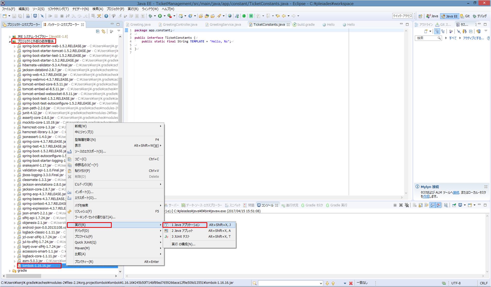
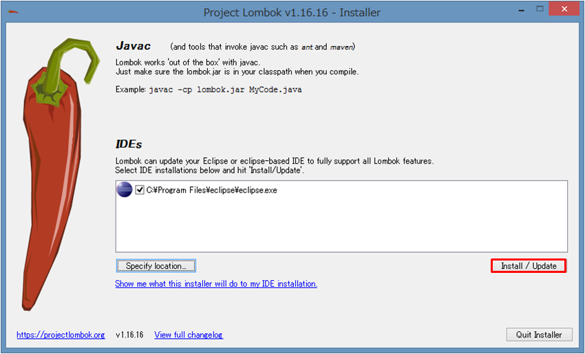

# 環境構築

## eclipse

* 以下をダウンロード
	* 32bit
		* http://ftp.jaist.ac.jp/pub/mergedoc/pleiades/4.6/pleiades-4.6.3-java-win-32bit-jre_20170323.zip
	* 64bit
		* http://ftp.jaist.ac.jp/pub/mergedoc/pleiades/4.6/pleiades-4.6.3-java-win-64bit-jre_20170323.zip

### gradleの使い方
* http://dukelab.hatenablog.com/entry/2014/06/28/150608

### lombokインストール
1. プロジェクトエクスプローラー
2. lombok-1.16.16.jar
3. 右クリック押下
4. 実行->Javaアプリケーション

5. Install/Update押下

6. eclipseを再起動する